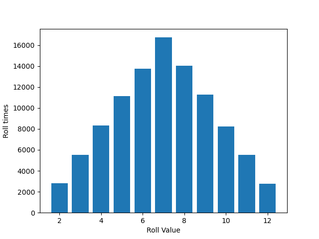

# 2023Spr_projects


It is the final project for UIUC IS 597 pr. Created by Xinmai Xuan (xinmaix2).
The coding part is finished

# Introduction

## What is Catan

Catan, formerly known as Settlers of Catan, is a strategic board game designed by Klaus Teuber and first published in 1995. The game is set on an island called Catan, where players take on the roles of settlers trying to build and develop their settlements by acquiring and trading resources.
The base game is played on a modular board consisting of hexagonal tiles representing five different resources: brick, wood, sheep, wheat, and ore, along with a desert tile that produces no resources. In addition, there are number tokens and harbors placed on the board, which play a role in resource production and trading.

## Basic Rules of Catan

1. Setup:
   Randomly arrange the resource tiles and number tokens to form the island. Each player places two settlements and two roads on the board.
2. Turn order:
   Players take turns clockwise, starting with the first player.
3. Turn structure:
   On a player's turn, they perform the following actions in order:
   a. Roll dice: The player rolls two six-sided dice to determine which tiles produce resources. Tiles with number tokens matching the sum of the dice generate resources for adjacent settlements and cities.
   b. Trade: Players can trade resources with each other or with the bank, using a 4:1 ratio or a more favorable rate if they have a settlement/city adjacent to a harbor.
   c. Build: Players can spend resources to build roads, settlements, or cities, or to buy development cards. Settlements must be at least two roads apart, and roads must connect to existing settlements/cities/roads.
4. Points:
   Players earn victory points for building settlements (1 point), cities (2 points), and acquiring certain development cards (1 point). The first player to reach 10 victory points wins the game.
5. The Robber:
   If a player rolls a 7, they must move the robber to any resource tile other than its current location, and that tile will not produce resources until the robber is moved again. Additionally, players with more than 7 resource cards must discard half of them (rounded down) when a 7 is rolled.
6. Development Cards:
   These cards can provide players with various benefits, such as resources, victory points, or the ability to move the robber.
7. Longest Road and Longest Army (Not in this simulation):
   Players can earn bonus points by having the longest continuous road (2 points) or the largest army through the use of Knight cards (2 points). These titles can change hands throughout the game.

# Elements of Catan

## terrain

The game board is consisted by 19 different terrains. Each terrain owns a specific number and a generated resource. Player would get the resource the time they build a settlement or a cicy besides the terrain which owns the same number as the results of  dice rolls.

- resource type
  There are six different resources:
  - Hills: Resources number 1, Produce Brick, 3 in total
  - Forest: Resources number 2, Produce Lumber, 4 in total
  - Mountains: Resources number 3, Produce Ore, 3 in total
  - Fields: Resources number 4, Produce Grain, 4 in total
  - Pasture: Resources number 5, Produce Wool, 4 in total
  - Desert: Resources number 0 Produce Nothing, 1 in total
- Number
  Each terrain, except Desert, has a special points between 2 and 14, except 7.
- Harbor
  Some terrains located on the edge of the board may have harbors. There are 2 main types of harbors: Generic Harbor and Special Harbor.
  Player could exchange 3 identical resources for any 1 other resource during trade phase if owns a generic Harbor.
  Player could exchange 2 designated resources for any 1 other resource during trade phase if owns a special Harbor, based on they type of special harbor.
  - There are 4 generic harbors and 5 special harbors.
    - generic harbor: Harbor number 6
    - special hill: number 1
    - special forest: number 2
    - special mountains: number 3
    - special fields: number 4
    - special pasture: number 5
- Point
  The point of the corner of each terrain. Each terrain has 6 points. Player could build settlement or upgrade a settlement on some point they could use.

## Building Types

There are 4 building options in Catan, however, we only use 3 types in this model

- Road
  Cost: 1 lumber and 1 brick
  Road connects two points. Settlement can only be build on points that connected by roads.
- Settlement
  Cost: 1 brick, 1 lumber, 1 grain, 1 wool
  Each settlement could gain 1 resource if possible. Settlement can not build on 2 neighbor points.
- City
  Cost: 2 grain, 3 ore
  City can only be upgraded from settlement. Each city could gain 2 resource if possible.
- Development Card
  Not included in this experiment.

## Classes

- Point

```python
class Point:
    def __init__(self, idx):
        self.idx = 0
        self.neighbors = []
```

- Terrain

```python
class Terrain:
    def __init__(self, resource, num, point_li):
        self.resource = resource
        self.num = num
        self.point = point_li
```

- Player

```python
class Player:
    def __init__(self):
        self.vp = 0  # victory points
        self.reachable_points = []  # points connected via roads
        self.settlements = []
        self.cities = []
        self.resources_list = [0, 0, 0, 0, 0]
        self.road_num = 0
        self.strategy = ""
```

- ResourceDict

```python
class ResourceDict:
    def __init__(self, resource_type: str):
        self.needed_dict = {0: 1, 1: 1} if resource_type == "road" else {0: 1, 1: 1, 3: 1, 4: 1} if \
            resource_type == "settlement" else {2: 3, 3: 2}
        self.resource_list = [2, 3, 4] if resource_type == "road" else [2] if \
            resource_type == "settlement" else [0, 1, 4]
        self.target_list = [0, 1] if resource_type == "road" else [0, 1, 3, 4] if \
            resource_type == "settlement" else [2, 3]
```

- RecordList

```python
class RecordList:
    def __init__(self, vp_rec, set_rec, city_rec, road_rec, brick_rec, lum_rec, ore_rec, grain_rec, wool_rec):
        self.vp_rec = vp_rec
        self.set_rec = set_rec
        self.city_rec = city_rec
        self.road_rec = road_rec
        self.brick_rec = brick_rec
        self.lum_rec = lum_rec
        self.ore_rec = ore_rec
        self.grain_rec = grain_rec
        self.wool_rec = wool_rec
```

- RecordList

```python
class ResRecoder:
    def __init__(self, used_round, gamePass):
        self.used_round = used_round
        self.gamePass = gamePass
```

# Monte Carlo Simulation

## Random Variables:

Due to the real game rules and workload consideration, I listed all possible random variables that might be used in this final project.
Random Variables 1: The number of points obtained by rolling two dice. It should be simulated as triangular.
Random Variables 2: The resource distribution of each resource’s bricks.
Random Variables 3: The chance of earning resource of each resource’s bricks(Number for each terrain).

## Validating

- Number of Two Dice
  
- Border Generator
  Border for each simulation could be found in file `data\border\` folder

## Experiment & Predictions

## Basic Assumptions

- The number of rolling 2 dices will conform triangle distribution between [2, 12]
- Player would not trade without building demands
- Player would only choose the point has the highest probability as the default point
- Player would only build roads to the neighbor point has the highest probability unless on harbor prefer action

### Hypothesis 1

`Assume upgrading a city can help get the required vp points faster than case 2 building a new settlement. `

### Hypothesis 2

`Assume getting a particular port can help get the required vp points faster than upgrading a ctiy which could help get more resources.`

# Phrase 2:

# Phrase 3:
